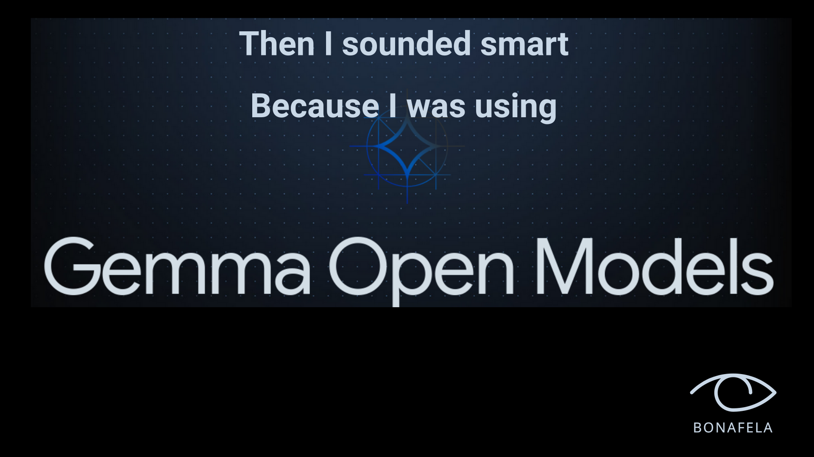

# Make Your Computer Smart For Free

The code in this repo is a text generation tool based on [Google Gemma](https://blog.google/technology/developers/gemma-open-models/). 
It generates answers to almost anything you ask in both interactive and batch mode.

Here are some of the most common uses:

**Text Generation:**

* **Writing:** Write various text formats, such as articles, stories, code, scripts, emails, and social media posts.
* **Translation:** Translate text between multiple languages.
* **Summarization:** Summarize text passages.
* **Question Answering:** Answer questions based on text.

**Information Extraction:**

* **Data extraction:** Extract information from text, such as facts, entities, and relationships.
* **Code extraction:** Extract code snippets from text.
* **Structured data extraction:** Extract structured data from text, such as tables and lists.

**Code Generation:**

* **Code translation:** Translate code between programming languages.
* **Code completion:** Complete code snippets.
* **Code debugging:** Help debug code.

**Key Features:**

* **Interactive Mode:** Allows you to enter prompts and receive generated text in the console.
* **Batch Mode:** Reads a file containing a list of prompts and generates text for each prompt.
* **Prompt History:** Stores previous prompts and allows you to reuse them in future sessions.
* **Prompt Styling:** The script supports different prompt styling options, including syntax highlighting and markdown formatting.
* **Model Quantization:** The script supports quantization of the model for improved performance.
* **Customizable:** Supports various model and style options.
* **Free:** All tools work offline and are free to use for personal and commercial use.


**Installation Prerequisites:**

* **GPU Device:** Your computer must have NVIDIA GPU with at least 8GB Memory.
* **GPU programming toolkit:** Install [NVIDIA's GPU programming toolkit](https://developer.nvidia.com/cuda-downloads).
* **Storage:** Free space of at least 30GB.
* **Package Manager:** Install [Conda](https://docs.conda.io/projects/conda/en/stable/user-guide/install/index.html) or [Micromamba](https://mamba.readthedocs.io/en/latest/installation/micromamba-installation.html) package manager. MicroMamba is preferred.
* **Hugging Face Token:** Get User Access Tokens from [huggingface](https://huggingface.co/settings/tokens)

All commands are executed on your shell terminal.

On you shell terminal export 

```bash
export HF_TOKEN="[YOUR ACCESS TOKEN]"
```

**Installation Instructions:**

Clone this repository in your local directory.

```bash
git clone https://github.com/bonafela/gemma
```

Run one of the following commands.

If you installed Conda:

```bash
conda env create -f conda_env.yml
```

If you installed Micromamba:

```bash
micromamba env create -f conda_env.yml
```

**Activate Conda Environment**

Run one of the following commands.

If you installed Conda:

```bash
conda activate gemma
```

If you installed Micromamba:

```bash
micromamba activate gemma
```

**Interactive Usage:**

To use this script, simply run the following command:

```
python cli.py --markdown --quant
```
This changes the shell to use text generation tool.
Your shell terminal should display text resembling the following:

```bash
google/gemma-7b-it@192.168.1.3 How can I assist you?
$
```

Now you can communicate with text generation tool by echoing text on your shell prompt.
Remember you are actually executing shell commands.
Be responsible by using `echo` command like the following:

```bash
echo "The following question got the nation divided. What is the value of 5 × (200 + 3). Explain like a Mathematician"
```


While in the text generation tool command, you can view current settings by executing:

```bash
settings
```

Output should be similar to the following:

```bash
markdown        : True
max_new_tokens  : 1024
top_k           : 50
top_p           : 0.7
prompt_output   : /deepmind/experiments/bonafela/gemma/.prompt_output.md
prompt_input    : None
```

You can change settings by crafting a dictionary like the following:

```bash
settings={'temperature' : 0.2, 'markdown' : False}
```
In addition, bottom toolbar on the shell is displayed to show current settings. 

`prompt_input` is a text file that you create.
It is useful when you don't want to wait for each command to complete in order to execute another command.

Here is an example of file contents:

```bash
settings={'markdown' : True, 'prompt_output' : '/deepmind/experiments/bonafela/gemma/demo/output/divided_anc.md'}
echo "The following question got the nation divided. What is the value of 5 × (200 + 3). Explain like a South African politician campaigning for ANC"

settings={'markdown' : True, 'prompt_output' : '/deepmind/experiments/bonafela/gemma/demo/output/divided_eff.md'}
echo "The following question got the nation divided. What is the value of 5 × (200 + 3). Explain like a South African politician campaigning for EFF"

settings={'markdown' : True, 'prompt_output' : '/deepmind/experiments/bonafela/gemma/demo/output/divided_da.md'}
echo "The following question got the nation divided. What is the value of 5 × (200 + 3). Explain like a South African politician campaigning for DA"
```

Suppose the file is located in `/deepmind/experiments/politicians.txt`.
There are two ways to execute batch commands.
Here is the first one.
Batch processing can be started in the text generation tool command by using the following command:

```bash
settings={'prompt_input' : '/deepmind/experiments/bonafela/gemma/demo/politicians.txt`}
```

**Batch Usage:**

This is the second way to start batch processing mode.
To use this script in batch mode, simply run the following command:

```
python cli.py --markdown --quant --prompt_input '/deepmind/experiments/bonafela/gemma/demo/politicians.txt`
```

**Additional Options:**

* `--model`: Specify the transformer model to use between `google/gemma-7b-it` and `google/gemma-2b-it`.
* `--quant`: Enable 4-bit quantization if your GPU is between 12GB and 8GB memory.
* `--markdown`: Enable markdown formatting for the output. Highly recommended.
* `--prompt_history`: By default a file `.prompt_history` to store prompt history is created at the location were this repo was cloned.
* `--prompt_style`: Default prompt syntax highlight style is 'github-dark'. You can choose different name by visiting [pygments styles](https://pygments.org/styles/)
* `--prompt_output`: By default a file `.prompt_output.md` to store the generated text is created at the location were this repo was cloned.
* `--prompt_input`: For batch processing of prompts like writing a book, specify the file containing prompt inputs.
* `--max_new_tokens`: Set the maximum number of new tokens to generate. Default is 1024.
* `--temperature`: Set the temperature for the model. Default is 0.2.
* `--top_k`: Set the number of top-k candidates to generate. Default is 0.7.
* `--top_p`: Set the probability of selecting each candidate. Default is 50.

**Notes:**

Combination of shell command and text generation tool gives you the ability to many things in less time.

There are better tools than this like [ollama](https://github.com/ollama/ollama).

For productivity solutions that makes use of State-Of-The-Art open source AI models visit [Bonafela](https://bonafela.co.za).
